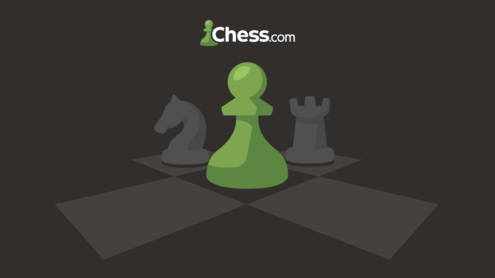

# ♟️ ChessMate

A comprehensive Chess.com profile analyzer and game reviewer built with Next.js. ChessMate allows you to explore player statistics, analyze game history, and review games with Stockfish engine integration.



## ✨ Features

### 🔍 Player Profile Analysis
- **Comprehensive Stats Dashboard**: View detailed statistics for Rapid, Blitz, Bullet, and Daily chess formats
- **Activity Heatmap**: GitHub-style activity visualization showing game frequency over time
- **Game History**: Browse and filter through all your past games with monthly archives
- **Profile Information**: Display player avatar, username, rating, and performance metrics

### 🎯 Game Review System
- **Interactive Chessboard**: Navigate through game moves with forward/backward controls
- **Stockfish Integration**: Real-time engine analysis with evaluation scores
- **Evaluation Bar**: Visual representation of position evaluation for both sides
- **Move Navigator**: Chess.com-style move list with easy navigation

## 🛠️ Tech Stack

- **Framework**: [Next.js 16](https://nextjs.org/) with React 19
- **Language**: TypeScript
- **Styling**: Tailwind CSS with custom configurations
- **Chess Libraries**:
  - `chess.js` - Chess game logic
  - `react-chessboard` - Interactive chessboard component
- **Chess API**: [chess-web-api](https://www.npmjs.com/package/chess-web-api) for Chess.com data
- **Engine**: [Stockfish 17](https://stockfishchess.org/) for game analysis
- **Charts**: Recharts for data visualization
- **UI Components**: Radix UI primitives
- **Icons**: Lucide React & React Icons

## 📦 Installation

1. **Clone the repository**
   ```bash
   git clone https://github.com/prathmesh796/chessmate.git
   cd chessmate
   ```

2. **Install dependencies**
   ```bash
   npm install
   ```

3. **Run the development server**
   ```bash
   npm run dev
   ```

4. **Open your browser**
   Navigate to [http://localhost:3000](http://localhost:3000)

## 🚀 Usage

### Analyzing a Player Profile

1. On the home page, enter a Chess.com username in the first search box
2. Click "Search" to view the player's profile
3. Explore:
   - **Stats Banner**: View ratings and performance across different game modes
   - **Activity Heatmap**: See game frequency patterns
   - **Previous Games**: Browse game history by month
   - **Profile Sidebar**: View player information and statistics

### Reviewing a Game

1. On the home page, enter a Chess.com username in the second input box
2. Click "Review" to access the game review interface
3. Use the navigation controls to:
   - Step through moves forward and backward
   - View Stockfish evaluation for each position
   - Analyze the evaluation bar for position assessment

## 📁 Project Structure

```
chessmate/
├── app/
│   ├── page.tsx              # Home page with search functionality
│   ├── search/
│   │   └── [username]/
│   │       └── page.tsx      # Player profile page
│   └── review/
│       └── page.tsx          # Game review page
├── components/
│   ├── Branner.tsx           # Banner component
│   ├── ChessBoard.tsx        # Interactive chessboard
│   ├── EvaluationBar.tsx     # Stockfish evaluation display
│   ├── HeatMap.tsx           # Activity heatmap
│   ├── NavBar.tsx            # Navigation bar
│   ├── PreviousGames.tsx     # Game history table
│   ├── ProfileAside.tsx      # Profile sidebar
│   └── StatsBanner.tsx       # Statistics display
├── types/
│   └── types.ts              # TypeScript type definitions
├── public/                   # Static assets
└── scripts/
    └── copy-stockfish.js     # Stockfish setup script
```

## 📊 API Integration

ChessMate uses the official Chess.com Public API:

- **Player Profile**: `https://api.chess.com/pub/player/{username}`
- **Player Stats**: `https://api.chess.com/pub/player/{username}/stats`
- **Game Archives**: `https://api.chess.com/pub/player/{username}/games/archives`
- **Monthly Games**: `https://api.chess.com/pub/player/{username}/games/{YYYY}/{MM}`

## 🤝 Contributing

Contributions are welcome! Please feel free to submit a Pull Request.

1. Fork the repository
2. Create your feature branch (`git checkout -b feature/AmazingFeature`)
3. Commit your changes (`git commit -m 'Add some AmazingFeature'`)
4. Push to the branch (`git push origin feature/AmazingFeature`)
5. Open a Pull Request

## 📝 License

This project is open source and available under the [MIT License](LICENSE).

## 🙏 Acknowledgments

- [Chess.com](https://www.chess.com/) for providing the public API
- [Stockfish](https://stockfishchess.org/) for the chess engine
- All the amazing open-source libraries that made this project possible

---

<div align="center">
  Made with ♟️ and ☕ by Prathmesh
</div>
